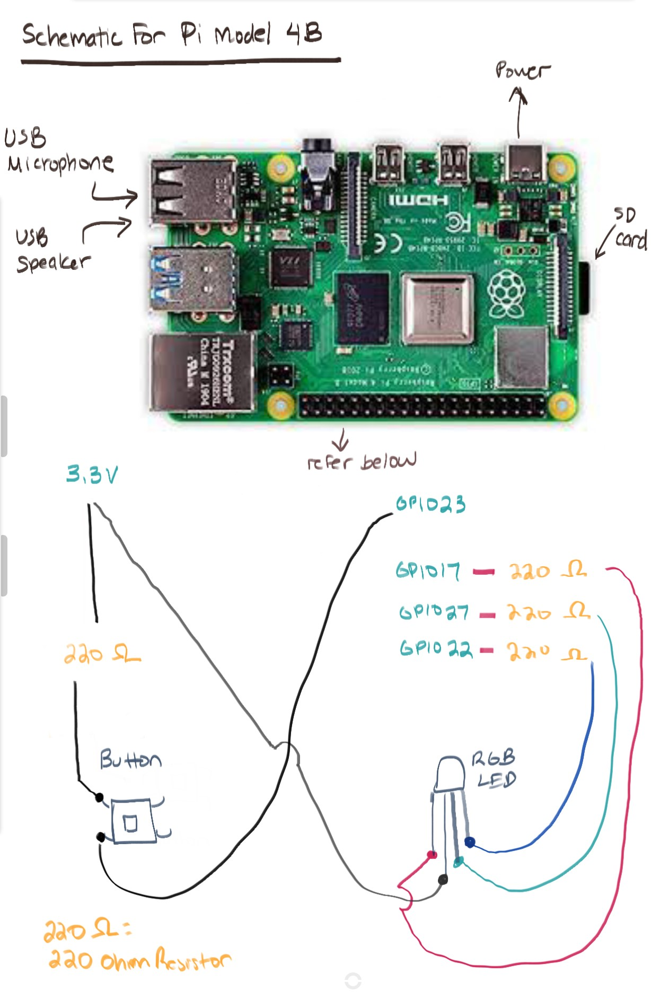

# Raspberry Pi Instructions
These are the steps I took to get the Raspberry PI working .
This supports chat right now.

## Hardware Required
I used the following components:
- (1) Raspberry Pi Model 4B (I recommend one with more than 1GB of RAM)
- (1) Good quality power adapter
- (1) 64 GB SD Card
- (1) RGB LED (used for indicating status)
- (1) Button
- (3) 232 Ohm Resistors
- (6+) Jumper Wires
- (1) USB Speaker (I used this one...it's just ok: https://www.amazon.com/HONKYOB-Speaker-Computer-Multimedia-Notebook/dp/B075M7FHM1/ref=sr_1_8?keywords=small+usb+speaker&qid=1688931333&sr=8-8)
- (1) USB Microphone (I used this one: https://www.amazon.com/Newest-YOUMI-Microphone-Laptop-desktop/dp/B01MQ2AA0X/ref=sr_1_4?crid=182CCNGL6PEVT&keywords=small+usb+microphone&qid=1688931382&sprefix=small+usb+mic%2Caps%2C642&sr=8-4)

## Hardware Schematic

## Software Install Steps
### 1 - Install Raspberry Pi Os
Start with a fresh installation of Raspberry Pi OS. 
Note that you will need a 64-bit version! You can select this in the imager.
https://www.raspberrypi.com/software/

I used the latest version, which is currently Bullseye 64-bit.
Once the SD card is imaged, you can insert it in your Raspberry Pi to go through the OS setup.

### 2 - Run the following commands

This will install support for recording:
<code> sudo apt-get install libportaudio2 </code>

### 3 - Set your credentials
Keep a copy or create a new copy of your GCP JSON Credentials. Note the path (this will be the value for GOOGLE_APPLICATION_CREDENTIALS)

You will need to set the following environmental variables: (export KEY=VALUE)
- OPENAI_API_KEY
- GOOGLE_APPLICATION_CREDENTIALS

I recommend writing this in your ~/.bashrc so that each time a terminal is loaded, so are the credentials.

### 4 - Clone the git repo
Run this in your command line: 
<code> git clone https://github.com/danbrick92/general-ai.git </code>

### 5 - Pip installs
In the root directory of general-ai, run :

<code> pip install -r requirements.txt </code>

### 6 - Test it
Before you try it, close as many apps as possible. This is not lightweight.

Run: <code> python src/main.py </code>

The software should now work.

### 7 - Set script to auto-run on start
When everything is working, add the following line to your ~/.bashrc file:
<code> python /home/pi/git/general-ai/src/main.py </code>

This will make it so that the script runs when you start the pi. Note that it can take some time to boot.
Also note that if you say "exit", it will close the program.
For now, the only way to restart is by unplugging and replugging.

Good luck!
